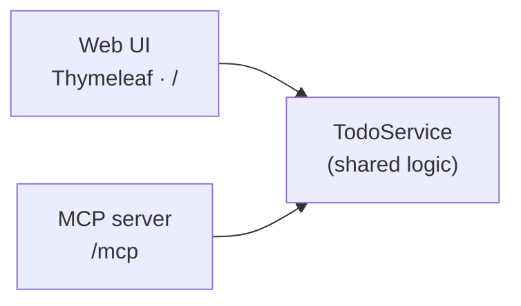

# Spring Boot Todo — Web UI to MCP

A small Spring Boot 4.1 / Java 25 Todo app that starts as a web app and exposes
the same data to MCP clients such as GitHub Copilot:

- a **Thymeleaf web UI** (`GET /`),
- and **MCP tools** (`POST /mcp`) that GitHub Copilot can call.

Both delegate to one `TodoService`.



**Stack:** Java 25 · Spring Boot 4.1.0 · Spring AI 2.0.0 · Thymeleaf · Maven

> [!IMPORTANT]
> This repository is a local development and demonstration sample, not a
> production deployment. Todos are stored in memory, the MCP mutation tools
> are unauthenticated, and Actuator returns detailed health information. Do not
> expose port 8080 to untrusted networks. Before deploying, add authentication,
> authorization, persistent storage, and production-appropriate Actuator settings.

---

## Prerequisites

- JDK 25 (`java -version` should report version 25)
- VS Code with the **Extension Pack for Java** and **Spring Boot Extension Pack**
- GitHub Copilot access for the Copilot and MCP workflow
- Node.js 18 or newer and Microsoft Edge for the optional Playwright workflow
- PowerShell 7, or Windows PowerShell 5.1 on Windows, for the optional MCP smoke test

Maven does not need to be installed separately; the repository includes the
Maven Wrapper.

## Run it

**Windows (PowerShell):**

```powershell
.\mvnw.cmd spring-boot:run
```

**macOS or Linux:**

```bash
./mvnw spring-boot:run
```

- Web UI: http://localhost:8080
- Health: http://localhost:8080/actuator/health

## Step 1 — The web app

The web app has four controller methods: show, add, toggle, and delete. See
[TodoController.java](src/main/java/com/example/tododemo/web/TodoController.java)
and [index.html](src/main/resources/templates/index.html).

## Step 2 — Add MCP

Each method in `TodoTools` is annotated with `@McpTool` and delegates to `TodoService`:

```java
@McpTool(name = "add_todo", description = "Create a new todo item with the given title.")
public Todo addTodo(@McpToolParam(description = "The title of the new todo", required = true) String title) {
    return service.add(title);
}
```

Five tools are exposed: `list_todos`, `get_todo`, `add_todo`, `complete_todo`, `delete_todo`.

**One critical setting** in [application.properties](src/main/resources/application.properties):

```properties
spring.ai.mcp.server.protocol=STREAMABLE
```

> The WebMVC MCP starter defaults to the older SSE transport. Without
> `protocol=STREAMABLE`, `POST /mcp` returns **404**. On startup the log confirms:
> `Registered tools: 5`.

### Connect VS Code

[.vscode/mcp.json](.vscode/mcp.json) points VS Code at the server:

```json
{ "servers": { "todo-mcp": { "type": "http", "url": "http://localhost:8080/mcp" } } }
```

Start the app first, then **Start** the server via the code-lens in `.vscode/mcp.json`.
In the Chat view (Agent mode), enable the `todo-mcp` tools and ask, e.g.:
*"Use the todo-mcp tools to add a todo called 'Email the stakeholders', then list all todos."*

The **Start** action connects VS Code to the already-running HTTP endpoint; it
does not launch the Spring Boot application.

---

## Test

Run the Java tests with the Maven Wrapper.

**Windows (PowerShell):**

```powershell
.\mvnw.cmd test
```

**macOS or Linux:**

```bash
./mvnw test
```

To test the MCP handshake, tool set, and `add_todo` result, keep
`spring-boot:run` running in one terminal and run the smoke test from a second:

```powershell
# PowerShell 7 on Windows, macOS, or Linux
pwsh -File ./scripts/mcp-smoke-test.ps1

# Windows PowerShell 5.1
powershell -ExecutionPolicy Bypass -File scripts\mcp-smoke-test.ps1
```

The script exits with an error unless the expected five tools and a valid
`add_todo` result are returned.

The UI exposes stable `data-testid` hooks (`new-todo-input`, `add-todo`, `todo-item`,
`delete-todo`) so a Playwright run can drive add → complete → delete end to end.

The tracked [.vscode/mcp.json](.vscode/mcp.json) also configures a verified
release of the official Playwright MCP server through `npx`, using installed
Microsoft Edge. It requires Node.js 18 or newer. Start the `playwright` server
from its code-lens and approve the server/tools when VS Code prompts.

---

## Optional next step — GitHub Copilot coding agent

Todos are kept **in memory** on purpose. A ready-to-assign issue,
[docs/copilot-agent-issue.md](docs/copilot-agent-issue.md), asks the cloud agent to add
Spring Data JPA + H2 persistence and a `dueDate` field. This requires a GitHub
account with Copilot coding agent enabled and write access to a repository or
fork. Create an issue from the prepared description, assign it to **@copilot**
(or use **"Delegate to coding agent"** in the GitHub Pull Requests view), then
review and test the draft pull request before deciding whether to merge it.

---

## Demo recording script

[scripts/script.md](scripts/script.md) is a four-episode walkthrough that uses this project
to demo **Java** development in **VS Code** with **GitHub Copilot**:

1. Build and debug a Spring Boot app (Extension Pack for Java, Spring Initializr, breakpoints, live memory view).
2. Expose the endpoints to Copilot as **MCP** tools.
3. Let Copilot test the UI end to end with **Playwright**.
4. Hand a new feature to the **GitHub Copilot coding agent**, then review and validate the draft PR it opens.

---

## Contributing and support

- Read [CONTRIBUTING.md](CONTRIBUTING.md) before submitting a pull request.
- Use [SUPPORT.md](SUPPORT.md) for help and issue-reporting guidance.
- Report vulnerabilities according to [SECURITY.md](SECURITY.md), not through a public issue.
- Participation is governed by the [Microsoft Open Source Code of Conduct](CODE_OF_CONDUCT.md).

## License

MIT License. See [LICENSE](LICENSE) for details.