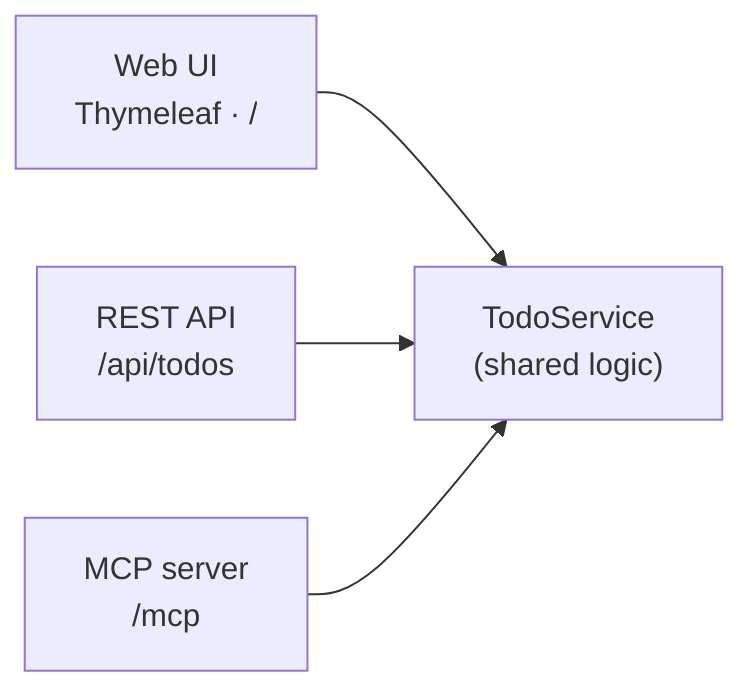

# Spring Boot Todo — REST + Web UI + MCP

A small Spring Boot 4.1 / Java 25 Todo app that exposes the **same** operations three ways:

- a **Thymeleaf web UI** (`GET /`),
- a **JSON REST API** (`/api/todos`),
- and **MCP tools** (`POST /mcp`) that GitHub Copilot can call.

All three delegate to one `TodoService`, so they can never drift apart.



**Stack:** Java 25 · Spring Boot 4.1.0 · Spring AI 2.0.0 · Thymeleaf · Maven

---

## Run it

```powershell
.\mvnw.cmd spring-boot:run
```

- Web UI: http://localhost:8080
- REST: http://localhost:8080/api/todos
- Health: http://localhost:8080/actuator/health

The web UI and the REST API live in
[TodoController.java](src/main/java/com/example/tododemo/web/TodoController.java)
(a single `@Controller`); the MCP tools are in
[TodoTools.java](src/main/java/com/example/tododemo/mcp/TodoTools.java).

REST surface:

| Method | Path | Purpose |
|---|---|---|
| `GET` | `/api/todos` | List all |
| `GET` | `/api/todos/{id}` | Get one |
| `POST` | `/api/todos` | Create (`{"title":"..."}`) |
| `PUT` | `/api/todos/{id}` | Update title + completion |
| `DELETE` | `/api/todos/{id}` | Delete |

---

## MCP tools

Each method in `TodoTools` is annotated with `@McpTool` and delegates to `TodoService`:

```java
@McpTool(name = "add_todo", description = "Create a new todo item with the given title.")
public Todo addTodo(@McpToolParam(description = "The title of the new todo", required = true) String title) {
    return service.add(title);
}
```

Five tools are exposed: `list_todos`, `get_todo`, `add_todo`, `complete_todo`, `delete_todo`.

**One critical setting** in [application.properties](src/main/resources/application.properties):

```properties
spring.ai.mcp.server.protocol=STREAMABLE
```

> The WebMVC MCP starter defaults to the older SSE transport. Without
> `protocol=STREAMABLE`, `POST /mcp` returns **404**. On startup the log confirms:
> `Registered tools: 5`.

### Connect VS Code

[.vscode/mcp.json](.vscode/mcp.json) points VS Code at the server:

```json
{ "servers": { "todo-mcp": { "type": "http", "url": "http://localhost:8080/mcp" } } }
```

Start the app first, then **Start** the server via the code-lens in `.vscode/mcp.json`.
In the Chat view (Agent mode), enable the `todo-mcp` tools and ask, e.g.:
*"Use the todo-mcp tools to add a todo called 'Email the stakeholders', then list all todos."*

---

## Test

```powershell
.\mvnw.cmd test                                                       # 11 tests: service, REST, UI, MCP context
powershell -ExecutionPolicy Bypass -File scripts\mcp-smoke-test.ps1   # MCP handshake + tools/call (app must be running)
```

The UI exposes stable `data-testid` hooks (`new-todo-input`, `add-todo`, `todo-item`,
`delete-todo`) so a Playwright run can drive add → complete → delete end to end.

---

## Next step — GitHub Copilot cloud agent

Todos are kept **in memory** on purpose. A ready-to-assign issue,
[docs/copilot-agent-issue.md](docs/copilot-agent-issue.md), asks the cloud agent to add
Spring Data JPA + H2 persistence and a `dueDate` field. Assign it to **@copilot** (or use
**"Delegate to coding agent"** in the GitHub Pull Requests view) and review the PR it opens.