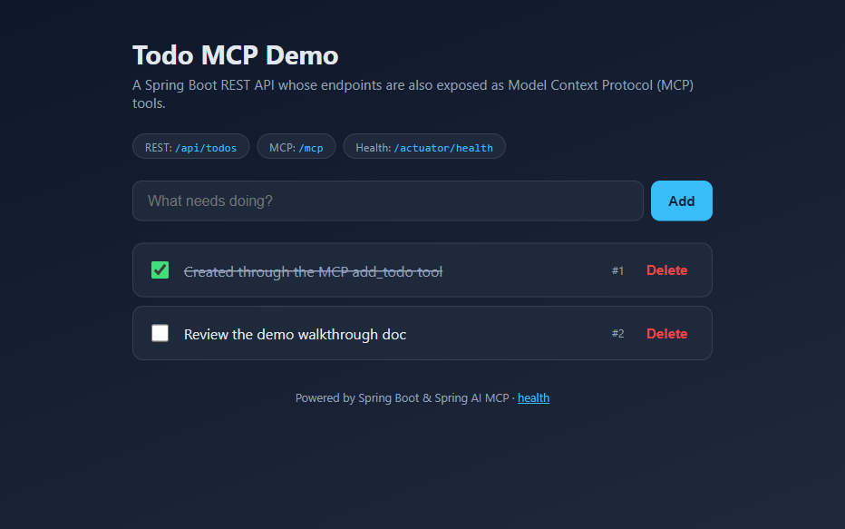
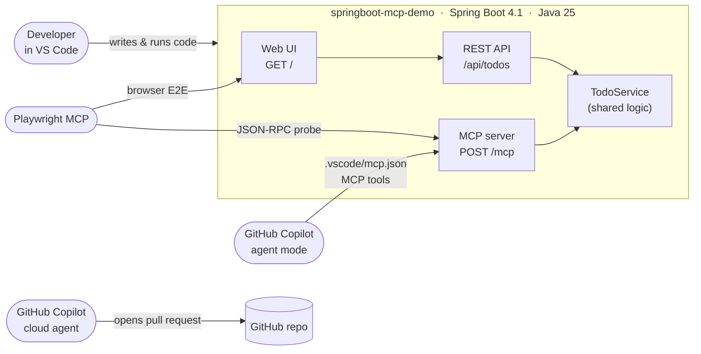

# Build, Expose & Test a Spring Boot API with MCP, Playwright and GitHub Copilot

### An end-to-end developer walkthrough in VS Code

This guide walks through building a real Spring Boot service in VS Code, turning
its endpoints into **MCP tools** that GitHub Copilot can call, validating the
whole flow with the **Playwright MCP server**, and finally handing an enhancement
to the **GitHub Copilot cloud coding agent**. Every step lists exactly *where* in
VS Code the action happens and *what* to click or run.

A complete, working sample app — `springboot-mcp-demo` — accompanies this guide
and was used to validate every step below.

---

## Executive summary

| | |
|---|---|
| **What we built** | A Spring Boot 4.1 Todo service: a REST API, a small web UI, and the *same* operations exposed as Model Context Protocol (MCP) tools. |
| **Why it matters** | One business service becomes usable by humans (web UI), by software (REST), **and by AI assistants** (MCP) — with no duplicated logic. |
| **How we proved it** | 10 automated tests, a live REST/health smoke test, an MCP `tools/list` + `tools/call` handshake, and a Playwright browser run that drove the UI end-to-end. |
| **What's next** | A pre-written issue lets the GitHub Copilot **cloud** agent add database persistence on its own and open a pull request. |
| **Stack (all latest GA)** | Java 25 · Spring Boot 4.1.0 · Spring AI 2.0.0 · Maven 3.9.11 |



> The screenshot above is a real capture from the Playwright run: item **#1** was
> created by calling the MCP `add_todo` tool, item **#2** was added through the
> browser UI, and #1 was completed by clicking its checkbox.

---

## Architecture at a glance



The key idea: **`TodoService` is the single source of truth.** The REST
controller and the MCP tools both delegate to it, so the API you test with
`curl` and the tools Copilot calls can never drift apart.

---

## Prerequisites & environment

This walkthrough was validated on Windows with the following — all confirmed
installed and current:

| Component | Version | How to confirm |
|---|---|---|
| Java (Microsoft OpenJDK) | **25.0.2 LTS** | `java -version` |
| Maven | **3.9.11** | `mvn -v` (the project also ships a wrapper, `mvnw`) |
| Node.js (for Playwright MCP) | **25.x** | `node -v` |
| Spring Boot | **4.1.0** | from `pom.xml` |
| Spring AI (MCP server) | **2.0.0** | from `pom.xml` |

### Required VS Code extensions

Install these from the **Extensions** view (`Ctrl+Shift+X`) — search by the ID:

| Extension | ID | Purpose |
|---|---|---|
| Extension Pack for Java | `vscjava.vscode-java-pack` | Java language, debugger, Maven, test runner, project view |
| Spring Boot Extension Pack | `vmware.vscode-boot-dev-pack` | Spring Initializr, Spring Boot Dashboard, Spring Tools |
| GitHub Copilot | `GitHub.copilot` | AI agent mode + MCP client |
| GitHub Copilot Chat | `GitHub.copilot-chat` | Chat / agent UI that consumes MCP tools |
| GitHub Pull Requests | `GitHub.vscode-pull-request-github` | Delegate work to the Copilot cloud agent |

### MCP servers

VS Code's MCP client configuration lives in `mcp.json`. This demo uses two MCP
servers:

- **Playwright MCP** (browser automation) — declared in your **user** `mcp.json`:
  `npx @playwright/mcp@latest`.
- **The Todo app's own MCP server** — declared in this **workspace** at
  [.vscode/mcp.json](.vscode/mcp.json), pointing at `http://localhost:8080/mcp`.

---

## Step 1 — Install Java, Spring Boot & VS Code extensions (Getting started with Maven)

**Goal:** a working Java + Spring + Maven toolchain inside VS Code.

### 1a. Java

1. Install the **Microsoft Build of OpenJDK 25** (or any JDK 25).
2. Open a terminal in VS Code (**Terminal → New Terminal**, or `` Ctrl+` ``) and run:
   ```powershell
   java -version
   ```
   You should see `openjdk version "25.x"`.
3. The **Extension Pack for Java** auto-detects JDKs. To verify or pin one, run
   **`Java: Configure Java Runtime`** from the Command Palette (`Ctrl+Shift+P`).

### 1b. Extensions

Install the extensions from the table above. The two **packs** pull in
everything else (language server, debugger, Maven, test runner, Spring Boot
Dashboard, Spring Initializr).

### 1c. Getting started with Maven

Maven is the build tool. You do **not** need a global install to build this
project, because it ships the **Maven Wrapper** (`mvnw` / `mvnw.cmd`), which
downloads the correct Maven version automatically.

- **Where in VS Code:** the **Maven** view appears in the Explorer sidebar (from
  the Java extension pack). It lists every Maven *lifecycle goal* you can click
  to run.
- **Key files:**
  - [pom.xml](pom.xml) — declares the
    parent, dependencies and Java version.
  - `mvnw.cmd` — the wrapper entry point.
- **The goals you'll use most:**

  | Command | What it does |
  |---|---|
  | `.\mvnw.cmd compile` | Compile sources |
  | `.\mvnw.cmd test` | Run the test suite |
  | `.\mvnw.cmd package` | Build the runnable JAR (runs tests too) |
  | `.\mvnw.cmd spring-boot:run` | Start the app |

> **Tip:** prefer `.\mvnw.cmd` (wrapper) over a global `mvn` so everyone builds
> with the same Maven version. A global `mvn -v` should still report Maven 3.9+.

---

## Step 2 — Build a Spring Boot API in VS Code

**Goal:** a running Todo REST API with a web UI.

### 2a. Generate the project with Spring Initializr

1. Command Palette (`Ctrl+Shift+P`) → **`Spring Initializr: Create a Maven Project`**.
2. Answer the prompts:
   - **Spring Boot version:** `4.1.0`
   - **Language:** Java · **Group:** `com.example` · **Artifact:** `springboot-mcp-demo`
   - **Packaging:** Jar · **Java version:** `25`
   - **Dependencies:** *Spring Web*, *Spring Boot Actuator*, *Validation*, and
     **MCP Server**.
3. Choose a folder; VS Code scaffolds the project and offers to open it.

> The accompanying sample was generated exactly this way. Selecting *Spring Web*
> automatically upgrades the MCP dependency to the WebMVC variant
> (`spring-ai-starter-mcp-server-webmvc`) so the server speaks HTTP.

### 2b. What got created

```
./
├── pom.xml                         # Boot 4.1 + Spring AI BOM 2.0.0 + Java 25
├── mvnw / mvnw.cmd                 # Maven Wrapper
└── src/main/
    ├── java/com/example/tododemo/
    │   ├── SpringbootMcpDemoApplication.java
    │   ├── model/Todo.java
    │   ├── repository/TodoRepository.java   # in-memory (becomes the Step 5 task)
    │   ├── service/TodoService.java         # shared by REST + MCP
    │   ├── web/TodoController.java          # REST /api/todos
    │   ├── web/dto/…                        # request bodies + validation
    │   └── mcp/TodoTools.java               # @McpTool methods
    └── resources/
        ├── application.properties
        └── static/index.html                # the web UI
```

The REST surface in [TodoController.java](src/main/java/com/example/tododemo/web/TodoController.java):

| Method | Path | Purpose |
|---|---|---|
| `GET` | `/api/todos` | List all todos |
| `GET` | `/api/todos/{id}` | Get one |
| `POST` | `/api/todos` | Create (`{"title": "..."}`) |
| `PUT` | `/api/todos/{id}` | Update title + completion |
| `DELETE` | `/api/todos/{id}` | Delete |

### 2c. Run it

- **Easiest:** open the **Spring Boot Dashboard** (Explorer sidebar), select
  `springboot-mcp-demo`, and click **▶ Run**.
- **Terminal:**
  ```powershell
  .\mvnw.cmd spring-boot:run
  ```

The app starts on **http://localhost:8080**. Open it for the web UI, and check
health at **http://localhost:8080/actuator/health** (returns `{"status":"UP"}`).

Quick API smoke test (PowerShell):
```powershell
Invoke-RestMethod -Method Post http://localhost:8080/api/todos -ContentType application/json -Body '{"title":"Prepare stakeholder demo"}'
Invoke-RestMethod http://localhost:8080/api/todos
```

---

## Step 3 — Expose your Spring Boot API endpoints via MCP

**Goal:** the same operations become tools any MCP client (VS Code / Copilot) can
discover and call.

### 3a. The MCP tools

[TodoTools.java](src/main/java/com/example/tododemo/mcp/TodoTools.java)
is an ordinary Spring `@Component`. Each method is annotated with `@McpTool` and
delegates to `TodoService`:

```java
@McpTool(name = "add_todo", description = "Create a new todo item with the given title.")
public Todo addTodo(
        @McpToolParam(description = "The title of the new todo", required = true) String title) {
    return service.add(title);
}
```

Five tools are exposed: `list_todos`, `get_todo`, `add_todo`, `complete_todo`,
`delete_todo`. Spring AI's annotation scanner registers them automatically — no
wiring code required.

### 3b. One critical setting

In [application.properties](src/main/resources/application.properties):

```properties
spring.ai.mcp.server.protocol=STREAMABLE
spring.ai.mcp.server.name=todo-mcp-server
spring.ai.mcp.server.version=1.0.0
```

> **Gotcha (validated):** the WebMVC MCP starter defaults to the older **SSE**
> transport. Without `protocol=STREAMABLE`, `POST /mcp` returns **404**. Setting
> it publishes the modern Streamable-HTTP endpoint at
> **http://localhost:8080/mcp**.

On startup the log confirms it: `McpServerAutoConfiguration : Registered tools: 5`.

### 3c. Connect VS Code to the server (the "VS Code MCP server")

The workspace file [.vscode/mcp.json](.vscode/mcp.json) tells VS Code's MCP
client where to find the server:

```json
{
  "servers": {
    "todo-mcp": { "type": "http", "url": "http://localhost:8080/mcp" }
  }
}
```

- **Start/inspect it:** open `.vscode/mcp.json` and click the **Start** code-lens
  above the server, or run **`MCP: List Servers`** from the Command Palette.
  (The app must be running first.)

### 3d. Use the tools from Copilot

1. Open the **Chat** view (`Ctrl+Alt+I`) and switch the mode dropdown to **Agent**.
2. Click the **tools** (🔧) icon and confirm the `todo-mcp` tools are enabled.
3. Ask, for example: *"Use the todo-mcp tools to add a todo called 'Email the
   stakeholders', then list all todos."* Copilot calls `add_todo` and
   `list_todos`, and the change appears in the web UI.

---

## Step 4 — Test your MCP workflow via Playwright

**Goal:** prove the whole thing works — both the **web UI** and the **MCP
endpoint** — using the Playwright MCP server.

### 4a. The web UI, end to end

With the app running, the Playwright MCP server drives a real browser. In Copilot
agent mode you can ask it to *"open http://localhost:8080, add a todo, complete
it, then delete it,"* and it will navigate, type, click and verify. The
validation run for this guide did exactly that and produced the screenshot at the
top — confirming: create, complete (with persistence), and delete all work
through the UI.

The UI exposes stable `data-testid` hooks (`new-todo-input`, `add-todo`,
`todo-item`, `delete-todo`) so the browser steps are robust.

### 4b. The MCP endpoint directly

A reusable script,
[scripts/mcp-smoke-test.ps1](scripts/mcp-smoke-test.ps1),
performs the full MCP handshake over Streamable-HTTP and was confirmed to output:

```text
1. initialize  -> server: todo-mcp-server v1.0.0  (session …)
2. notifications/initialized -> sent
3. tools/list  -> 5 tools: add_todo, complete_todo, delete_todo, get_todo, list_todos
4. tools/call add_todo -> {"id":1,"title":"Created through the MCP add_todo tool", …}

MCP smoke test PASSED.
```

Run it yourself (app must be running):
```powershell
powershell -ExecutionPolicy Bypass -File scripts\mcp-smoke-test.ps1
```

### 4c. Automated build tests

`.\mvnw.cmd test` runs **10** tests — fast unit tests for `TodoService`, full
MockMvc integration tests for the REST API, and a context-load test that proves
the MCP server auto-configures cleanly.

---

## Step 5 — Improve your app further via GitHub Copilot Cloud Agent

**Goal:** let Copilot's **cloud** coding agent implement a real enhancement and
open a pull request — while you stay in review mode.

The sample deliberately keeps todos **in memory**. That's the perfect first job
for the cloud agent: add database persistence.

1. **Publish to GitHub.** Use **Source Control** (`Ctrl+Shift+G`) →
   *Publish to GitHub* (or `git init`, commit, and `git push` to a new repo).
2. **Create the issue.** A ready-to-paste issue is provided in
   [docs/copilot-agent-issue.md](docs/copilot-agent-issue.md): *"Add persistent
   storage (Spring Data JPA + H2) and a `dueDate` field with filtering."* It
   includes acceptance criteria, technical guidance and verification steps.
3. **Delegate to Copilot.** Assign the issue to **@copilot**, or from the
   **GitHub Pull Requests** view use **"Delegate to coding agent."** The agent
   spins up its own environment, writes the code, and opens a pull request.
4. **Review the PR.** Open the pull request in VS Code (GitHub Pull Requests
   view), read the diff, run the tests, request changes if needed, and merge.

> Requires a GitHub account with the Copilot **coding agent** enabled on the
> repository.

---

## Project layout (deliverables)

| Path | What it is |
|---|---|
| [src/main/java/com/example/tododemo/mcp/TodoTools.java](src/main/java/com/example/tododemo/mcp/TodoTools.java) | The `@McpTool` definitions |
| [scripts/mcp-smoke-test.ps1](scripts/mcp-smoke-test.ps1) | MCP endpoint test script |
| [.vscode/mcp.json](.vscode/mcp.json) | Registers the app's MCP server with VS Code |
| [docs/copilot-agent-issue.md](docs/copilot-agent-issue.md) | The ready-to-assign cloud-agent issue |
| [docs/images/todo-ui-demo.png](docs/images/todo-ui-demo.png) | Screenshot from the Playwright run |

---

## Command reference

```powershell
# Build & test
.\mvnw.cmd clean package            # compile, test, build the JAR

# Run (either one)
.\mvnw.cmd spring-boot:run
java -jar target\springboot-mcp-demo-0.0.1-SNAPSHOT.jar

# REST smoke test
Invoke-RestMethod http://localhost:8080/api/todos
Invoke-RestMethod http://localhost:8080/actuator/health

# MCP smoke test
powershell -ExecutionPolicy Bypass -File scripts\mcp-smoke-test.ps1
```

---

## Troubleshooting

| Symptom | Cause & fix |
|---|---|
| `POST /mcp` returns **404** | The WebMVC MCP starter defaults to SSE. Set `spring.ai.mcp.server.protocol=STREAMABLE`. |
| Copilot doesn't see the tools | Start the app first, then **Start** the server in `.vscode/mcp.json`; confirm the tools are enabled via the 🔧 icon in Agent mode. |
| `package org.springframework.boot.test.autoconfigure.web.servlet does not exist` | Spring Boot 4 moved `@AutoConfigureMockMvc` to `org.springframework.boot.webmvc.test.autoconfigure`. |
| `Unable to access jarfile …` | Run `java -jar` from the project folder, or use the full path to the JAR in `target/`. |
| Port 8080 in use | Stop the other process, or add `server.port=8081` to `application.properties` (and update `.vscode/mcp.json`). |
| Playwright first run is slow | `npx @playwright/mcp@latest` downloads a browser on first use. |

---

## Links

- Spring Initializr — https://start.spring.io
- Spring Boot reference — https://docs.spring.io/spring-boot/
- Spring AI MCP Server Boot Starter — https://docs.spring.io/spring-ai/reference/api/mcp/mcp-server-boot-starter-docs.html
- Model Context Protocol — https://modelcontextprotocol.io
- VS Code MCP docs — https://code.visualstudio.com/docs/copilot/chat/mcp-servers
- GitHub Copilot coding agent — https://docs.github.com/en/copilot/using-github-copilot/coding-agent

---

## Appendix — How this project was created

This project was bootstrapped with **Spring Initializr**; no files were written
by hand at the start. This appendix captures the exact recipe so the scaffolding
step can be reproduced or demoed from scratch.

### Option A — VS Code Spring Initializr (used for this project)

The **Spring Boot Extension Pack** adds Initializr straight into VS Code, so the
project never left the editor.

1. Command Palette (`Ctrl+Shift+P`) → **`Spring Initializr: Create a Maven Project`**.
2. Answer the prompts in order:

   | Prompt | Value |
   |---|---|
   | Spring Boot version | **4.1.0** |
   | Language | **Java** |
   | Group Id | **com.example** |
   | Artifact Id | **springboot-mcp-demo** |
   | Packaging type | **Jar** |
   | Java version | **25** |
   | Dependencies | **Spring Web** · **Spring Boot Actuator** · **Validation** · **MCP Server** |

3. Pick a target folder → VS Code generates the project and offers to **Open** it.

### Option B — start.spring.io (browser, good for a live demo)

The same result can be generated from the web UI. This link pre-fills every field
above — expand **Dependencies** on screen to show them being added, then click
**Generate**:

```
https://start.spring.io/#!type=maven-project&language=java&platformVersion=4.1.0&packaging=jar&jvmVersion=25&groupId=com.example&artifactId=springboot-mcp-demo&name=springboot-mcp-demo&description=Spring%20Boot%20Todo%20API%20exposed%20as%20MCP%20tools&packageName=com.example.tododemo&dependencies=web,actuator,validation,spring-ai-mcp-server
```

The four dependency IDs are `web`, `actuator`, `validation`, and
`spring-ai-mcp-server`.

### Option C — Ask GitHub Copilot (agent mode)

You can also have Copilot drive the scaffold for you. In the **Chat** view
(`Ctrl+Alt+I`), switch the mode dropdown to **Agent** and paste:

```text
Build a Spring Boot API in VS Code using Spring Initializr: a Maven project on
Spring Boot 4.1.0 and Java 25, group com.example, artifact springboot-mcp-demo,
base package com.example.tododemo, with the Spring Web, Actuator, Validation,
and MCP Server dependencies.
```

> **How this repo was actually created:** the scaffold wasn't triggered by a
> dedicated "Spring Initializr" prompt. It happened while Copilot executed a
> broader build request — the origin prompt asked it to *"Build a Spring Boot API
> in VS Code"* (among five demo steps), and a follow-up *"Start implementation"*
> authorized the agent, which then chose Spring Initializr with the settings
> above. The prompt block above is the distilled, reproducible version of that
> step for demos.

### How those selections map to `pom.xml`

Initializr translated the four dependencies into these entries in
[pom.xml](pom.xml):

| Initializr dependency | Resulting artifact |
|---|---|
| Spring Web | `spring-boot-starter-webmvc` |
| Spring Boot Actuator | `spring-boot-starter-actuator` |
| Validation | `spring-boot-starter-validation` |
| MCP Server | `spring-ai-starter-mcp-server-webmvc` (+ `spring-ai-bom` 2.0.0) |

### Notes for anyone reproducing it

- **Base package** was set to `com.example.tododemo`, which is why the code lives
  under `src/main/java/com/example/tododemo/`.
- **Persistence was deliberately omitted.** No JPA/database dependency was
  selected so that "add persistent storage" could become the Step 5 enhancement
  handed to the GitHub Copilot cloud agent (see
  [docs/copilot-agent-issue.md](docs/copilot-agent-issue.md)).
- **Spring Web drives the MCP transport.** Because *Spring Web* is present,
  Initializr resolves the MCP Server dependency to its **WebMVC** variant, so the
  server can speak HTTP (later switched to Streamable-HTTP in
  [application.properties](src/main/resources/application.properties)).

> Everything after generation — the `Todo` model, `TodoService`, `TodoController`,
> the `@McpTool` methods in `TodoTools`, the static UI, and the tests — was added
> on top of this scaffold as described in **Step 2** and **Step 3** above.
